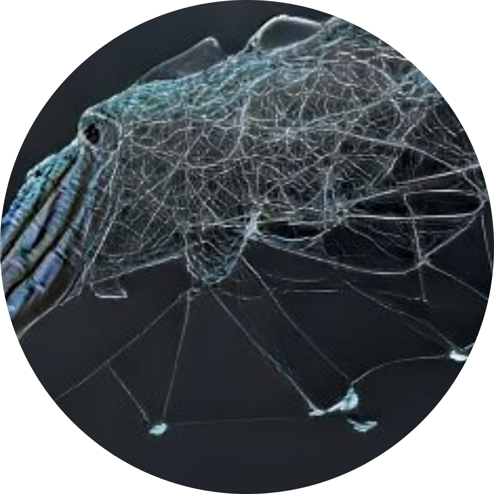

  

# Sepias

Sepias is an open-source, local-first, markdown-based, note-taking tool that is
**built for those that enjoy using a CLI** and use
[VS Code](https://code.visualstudio.com) as their daily code editor. It is a
niche personal knowledge management
([PKM](https://en.wikipedia.org/wiki/Personal_knowledge_management)) solution
built primarily for developers who value simplicity, speed and consistent
hierarchical note structure.

## Install

📦 Project is yet to make the `v1.0.0` release; please watch the Github repo
(top-right) for future updates.

## Roadmap

🗂 See [Projects](https://github.com/users/revett/projects/1).

## Why?

Sepias is a niche tool in the PKM ecosystem that was originally developed by
[@revett](https://revcd.com) as a Bash script after becoming frustrated with
overly complex GUI-based tools. It will appeal to those that:

- Use [VS Code](https://code.visualstudio.com) as their daily code editor
- Prefer to use a CLI to create and manage a knowledge base
- Value consistent hierarchical note structure, simplicity and speed

The project has taken inspiration from
[Dendron](https://github.com/dendronhq/dendron), and can be seen as a
lightweight alternative that is CLI focused.

## Features

Sepias is made up of three parts, each providing different features for the
user:

- CLI
- VS Code and the [Memo extension](https://github.com/svsool/memo) by
  [@svsool](https://github.com/svsool)
- Web app

### CLI

1. Create note, with schema hierarchy autocomplete
1. Knowledge base validation
1. Share notes publicly
1. Automatic note templating based on filename schema
1. Hierarchies via flat file structure (e.g. `area.pkm.tools.md`)
1. Front Matter metadata support for notes
1. Orphaned notes analysis
1. Missing backlink analysis
1. Knowledge base JSON export

### VS Code Memo Extension

> _See [svsool/memo](https://github.com/svsool/memo) for a list of all
> features._

1. Create backlinks
1. Backlink click-to-navigate (editor and preview)
1. Embedded notes
1. Backlinks panel
1. Automatic backlink updates on file rename
1. Backlink labelling
1. Full backlink naming on filename clash

#### Why Use an Extension?

[Svyat Sobol (@svsool)](https://github.com/svsool) has done an incredible job
with the extension; which provides all of the required core features. Therefore
it seems logical to focus on additional features provided by the CLI and web app
instead of duplicating effort.

### Web App

> _This is accessible via the user's local machine only._

1. Note graph visualisation
1. Schema hierarchy graph visualisation
1. Statistics
1. Rendered note view
1. Web search

## Credits

- Inspiration from the Dendron [`README`](https://github.com/dendronhq/dendron)
- Roadmap ideas from [Dendron](https://github.com/dendronhq/dendron),
  [Foam](https://github.com/foambubble/foam),
  [Obsidian](https://github.com/obsidianmd) and
  [RelaNote](https://relanote.com)
- Icon generated by
  [borisdayma/dalle-mini](https://github.com/borisdayma/dalle-mini)
