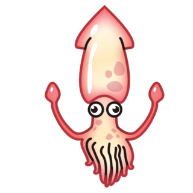

<p align="center">
  
</p>

# Sepias

[](https://github.com/revett/sepias/actions?query=branch%3Amain)
[](https://pkg.go.dev/github.com/revett/sepias)
[](https://goreportcard.com/report/github.com/revett/sepias)
[](https://github.com/revett/sepias/blob/main/LICENSE)

Minimalist CLI and VS Code workflow that I use to manage my notes / personal
knowledge management
([PKM](https://en.wikipedia.org/wiki/Personal_knowledge_management)).

## Design Principles

- Note hierarchy (`area.language.go.errors`) inspired by
  [Dendron](https://wiki.dendron.so)
- Schema inspired by the [PARA method](https://fortelabs.co/blog/para)
- Simplicity, originally started as a
  [bash script](https://github.com/revett/sepias/commit/ef85ce9d70593c8b3dfb8e1c2aab56300bbee959)

## Schema

> _The
> [original schema](https://github.com/revett/sepias/tree/275e8fae6fd3c60b27d220bf137e2441f616ccb3#schema)
> was an acronym for `sepias`, thus naming the project._

All notes fall under a specific schema type:

- **Area** - Sphere of activity with a standard to be maintained over time
  (taken from the [PARA method](https://fortelabs.co/blog/para))
- **Entity** - Person, company, location etc
- **Interview** - Notes from interviewing candidates
- **Project** - Notes linked to a goal, with a deadline (taken from the
  [PARA method](https://fortelabs.co/blog/para))
- **Review** - Weekly journal for keeping track of progress and events
- **Scratch** - Random note
- **System** - Checklists to follow when carrying out repeated tasks

## Workflow

- [VS Code](https://code.visualstudio.com/)
- Pinned terminal in tab 1 editor position (`Cmd+K Shift+Enter`)
- CLI usage of `sepias` within this terminal
- `Cmd+P` for navigating to notes within VS Code
- `Cmd+Shift+F` for searching all notes

### VS Code Extensions

> See
> [`.vscode/extensions.json`](https://github.com/revett/sepias/blob/main/.vscode/extensions.json).

| Extension                                                            | Description                                                                                           |
| -------------------------------------------------------------------- | ----------------------------------------------------------------------------------------------------- |
| [cSpell](https://github.com/streetsidesoftware/vscode-spell-checker) | • Spell checking                                                                                      |
| [Emojisense](https://github.com/mattbiernervscode-emojisense)        | • `:emoji:` syntax autocomplete                                                                       |
| [Markdown Emoji](https://github.com/mjbvz/vscode-markdown-emoji)     | • Markdown preview for `:emoji:` syntax                                                               |
| [Markdown Image](https://github.com/imlinhanchao/vsc-markdown-image) | • Paste images directly in to markdown                                                                |
| [Markdown Memo](https://github.com/svsool/memo)                      | • Creating and following backlinks between notes <br>• Renaming notes with automatic backlink updates |
| [Reflow Markdown](https://github.com/marvhen/reflowmarkdown)         | • Quickly format text to a preferred line length                                                      |
| [TODO Highlight](https://github.com/wayou/vscode-todo-highlight)     | • Highlight `todo-` annotations within notes                                                          |

### New Note Reminders

To avoid breaking the
[flow of writing](<https://en.wikipedia.org/wiki/Flow_(psychology)>) a new note,
I often will make use of the `todo-` annotation as a reminder to come back and
create other notes. For example:

```
Stoicism is a school of todo-hellenistic philosophy in Athens in the early 3rd
century BC.
```

Later when I have time, I'll go back and write notes on any `todo-` annotations
that the [TODO Highlight](https://github.com/wayou/vscode-todo-highlight)
extension prompts for within the "Problems" panel.

## Templates

The following templates are required locally:

```
./templates/area.md
./templates/entity.md
./templates/interview.cultural.md
./templates/interview.technical.md
./templates/project.md
./templates/review.md
./templates/scratch.md
./templates/system.md
```

Further optional custom templates can be added, for example:

```
./templates/area.language.md
./templates/area.language.go.md
...
```

The template is selected if it matches the prefix of the new note; the template
with the most hierarchical parts will be used first.

### Example

A new note is being created:

```
area.language.go.sentinel-errors.md
```

The following templates match as a prefix for the new note:

```
./templates/area.md
./templates/area.language.md
./templates/area.language.go.md
```

`./templates/area.language.go.md` is selected as it has the most hierarchical
parts, three.

## Shell Completion

Generate the shell completion script (Bash, fish, Zsh, PowerShell) using the
CLI:

```
sepias completion -h
```

## Doctor

Validate a local knowledge base by using the doctor command:

```
sepias doctor
```
