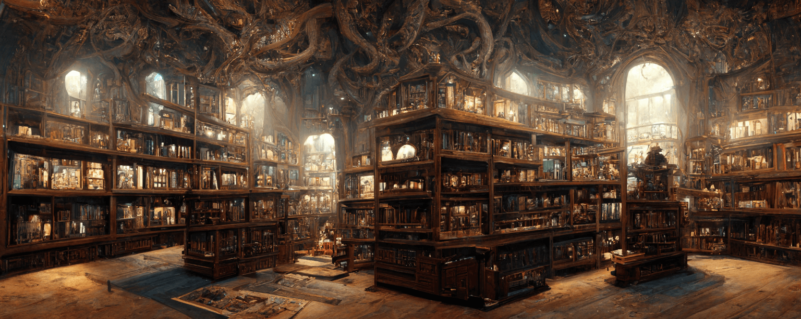

  

# Sepia

Sepia is an open-source, local-first, markdown-based, note-taking tool that is
**built for those that enjoy using a CLI** and use
[VS Code](https://code.visualstudio.com) as their daily code editor. It is a
niche personal knowledge management
([PKM](https://en.wikipedia.org/wiki/Personal_knowledge_management)) solution
built primarily for developers who value simplicity, speed and consistent
hierarchical note structure.

## Install

📦 The project is yet to make the `v1.0.0` release; please watch the GitHub repo
(top-right) for future updates.

## Roadmap

🗂 See [Projects](https://github.com/users/revett/projects/1).

## Why?

Sepia is a niche tool in the PKM ecosystem that was originally developed by
[@revett](https://revcd.com) as a Bash script after becoming frustrated with
overly complex GUI-based tools. It will appeal to those that:

- Use [VS Code](https://code.visualstudio.com) as their daily code editor
- Prefer to use a CLI to create and manage notes in a knowledge base
- Value consistent hierarchical note structure, simplicity, and speed

The project has taken inspiration from
[Dendron](https://github.com/dendronhq/dendron), and can be seen as a
lightweight alternative that is CLI focused.

## Features

  

Sepia is made up of three parts, each providing different features for the
user:

- CLI
- VS Code and the [Memo extension](https://github.com/svsool/memo) by
  [@svsool](https://github.com/svsool)
- Web app

### Why Use an Extension?

[Svyat Sobol (@svsool)](https://github.com/svsool) has done an incredible job
with the extension; which provides all the required core features. Therefore, it
seemed logical to focus on additional features provided by the CLI and web app
instead of duplicating effort.

## Credits

- Inspiration from the Dendron [README](https://github.com/dendronhq/dendron)
- Roadmap ideas from [Dendron](https://github.com/dendronhq/dendron),
  [Foam](https://github.com/foambubble/foam),
  [Obsidian](https://github.com/obsidianmd) and
  [RelaNote](https://relanote.com)
- All images generated by [Midjourney](https://www.midjourney.com/showcase)

---

  

